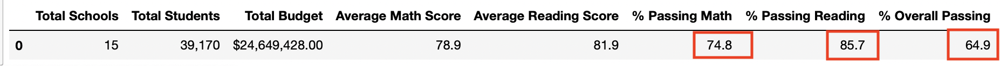

# **School_District_Analysis**

## **Overview:**

In this project, we analyze data from schools across a district, to get an insight into performance trends and patterns, which help the district make stragetic decisions about budget allocations. Data available includes student funding information and standardized test scores of students in the district. Data anomalies or errors such as incorrect scores of students of a particular school, have been fixed and the analysis has been repeated.

## **Results:**

### District Summary:

-  The District Summary has very small differences in data between the original analysis and the corrected analysis after Thomas High School's 9th Grader scores and numbers have been removed from the data.  
- The Average Math and reading scores remain the same.
- The percentage passing has very minute differences after the 9th graders are removed from the Student count with the new percentage being slightly less.
- The same can be seen in the following screenshots.

     #### _Original_
     
     

     #### _New_
     

