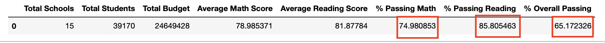
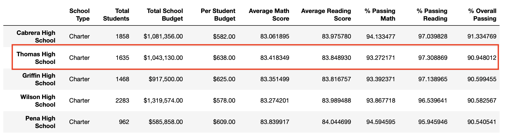
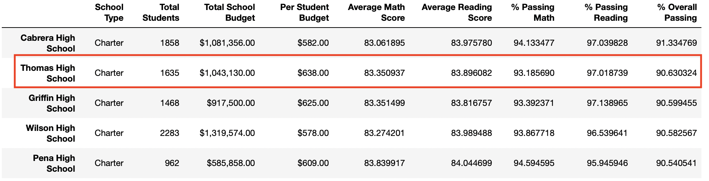
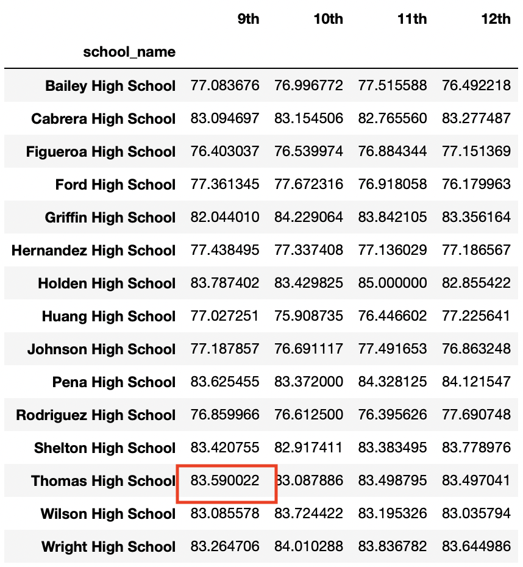
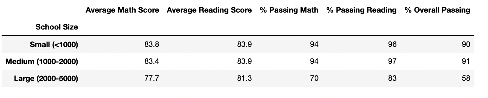

# **School District Analysis**

## **Overview:**

In this project, we analyze data from schools across a district, to get an insight into performance trends and patterns, which will help the district make stragetic decisions about budget allocations. Data available includes student funding information and standardized test scores of students in the district. Data anomalies or errors such as incorrect scores of students of a particular school, have been fixed and the analysis has been repeated.

## **Results:**
The latest updated analysis for PyCitySchools can be seen here. [PyCitySchools_Challenge](PyCitySchools_Challenge.ipynb).

Highlighted below are the differences between the original and the updated data analysis after Thomas High School's 9th Grader scores and numbers have been removed from the data.

### District Summary:

- The Average Math and reading scores remain nearly the same with a decrease of less than 0.1 points in the updated District Summary.
- The percentage passing Math and reading have fallen by about 0.1% 
- The Overall passing percentage has fallen by about 0.2%. 
- The differences in District Summary can be seen in the following screenshots.

     #### _Original:_
     

     #### _New:_
     

### School Summary:

- In the school summary for Thomas High School, it can be observed that the difference in average scores is very small between the original and new School Summary dataframes.
- The average math score has fallen by 0.07 points, while the average Reading Score has increased by 0.05 points.
- The percentage of students passing Math has reduced by 0.087%.  The percentage of students passing Reading has reduced by 0.29%. 
- The Overall passing percentage has decreased by 0.318%
- The following screenshots can be referred to.

    #### _Original:_
    

    #### _New:_
    

### School performance vs Other Schools:

- Even with the updated Average scores and percentage passed, and without the 9th graders scores, Thomas High School continues to remain in the second position in the Top 5 performing schools, as can be seen from the screenshots below.

    #### _Original:_
    

    #### _New:_
    

### Scores

- The Scores by grade remain the same for 10th to 12 grade, between the original and new Scores by Grade summary. The 9th graders' scores are unavailable and so, they are replaced by NaNs. This can be seen in the example screenshots below for the Math Scores by grade.

    #### _Original Math Scores by Grade:_
    

    #### _New Math Scores by Grade:_
    

- The scores by School Spending  summary is not affected by the change in data for 9th graders, as is evident from the screenshots below.

    #### _Original:_
    

    #### _New:_
    

- The scores by school size are not affected by the change in data for 9th graders. The results are the same in both cases.

    #### _Original and New:_
    

- The scores by school type are not affected by the change in data for 9th graders and the analysis yields the same result in both the original and new analysis, as shown below.

    #### _Original and New:_
    

## **Summary:**

In Summary, after replacing the reading and Math scores of 9th graders in Thomas High School to NaNs, the resultant changes are as follows:

- The most significant difference is that the scores of about 461 students belonging to 9th grade had to be replaced by NaNs. So the average scores and passing percentage calculations for Thomas High School have actually been made for 1174 10th to 12th graders for Thomas High School, rather than the full total of 1635 students.
- From the district summary it can be observed that the Overall passing percentage of the district has reduced slightly , when the data of the 9th grade students of Thomas High is excluded.
- As far as Thomas High's school summary is concerned, the percentage of students passing each individual subject ie. math and reading, as well as the overall pass percentage has reduced when the data of the 9th grade students is excluded. This may indicate that the original( incorrect) scores of the 9th grade students may have contributed towards a higher pass percentage.
- Because the accurate 9th grade scores for Thomas High School is unavailable, the school cannot participate in the scores by grade analysis for 9th Grade, for both reading and Math. The same analysis can be done only for the 10th, 11th and 12th grade for this school.

